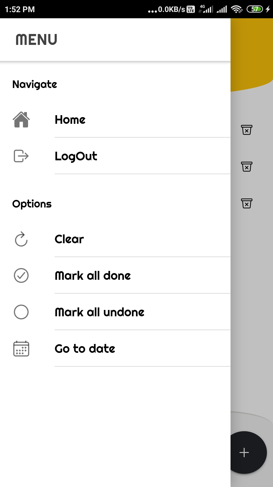
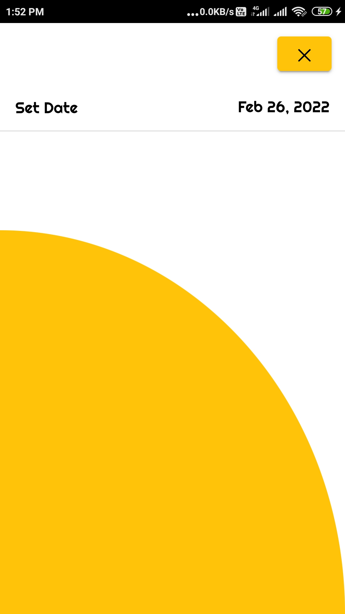
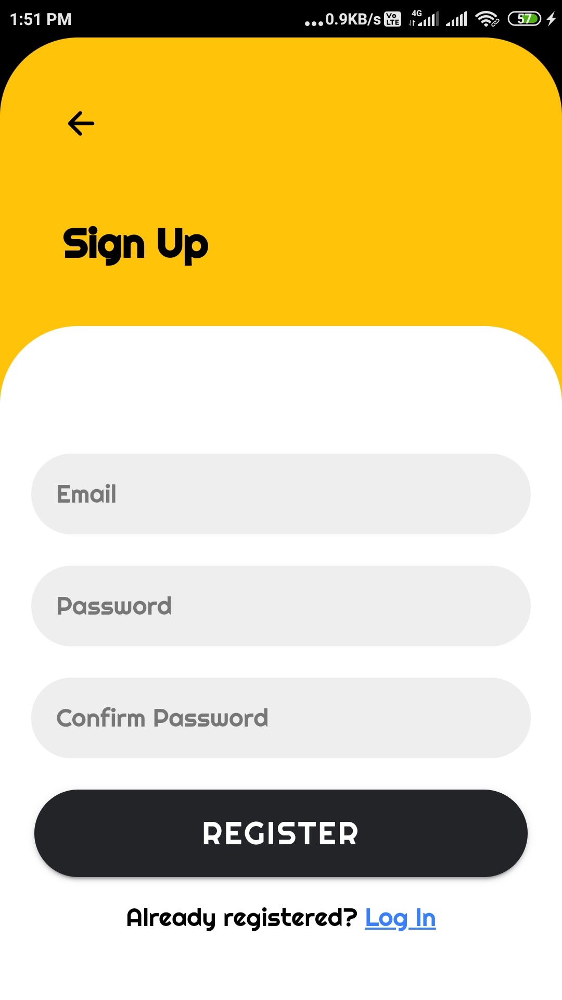
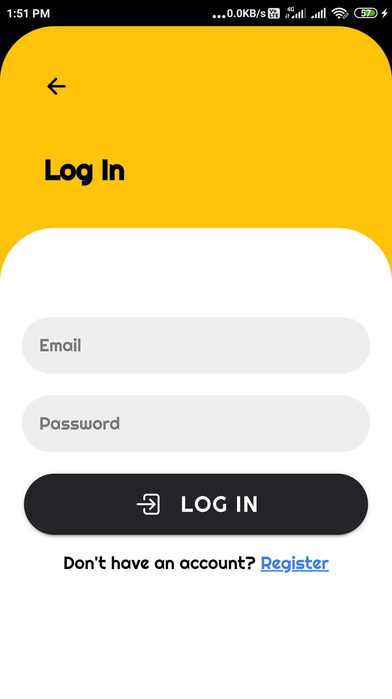

# ToDo-List
Simple CRUD application to learn IONIC framework

<table>
<tr>
<td>1
</td>
<td>

</td>
</tr>

<tr>
<td>2
</td>
<td>

</td>
</tr>

<tr>
<td>3
</td>
<td>

</td>
</tr>

<tr>
<td>4
</td>
<td>

</td>
</tr>

<tr>
<td>5
</td>
<td>

</td>
</tr>

<tr>
<td>6
</td>
<td>

</td>
</tr>

<tr>
<td>7
</td>
<td>

</td>
</tr>

<tr>
<td>8
</td>
<td>

</td>
</tr>

</table>
